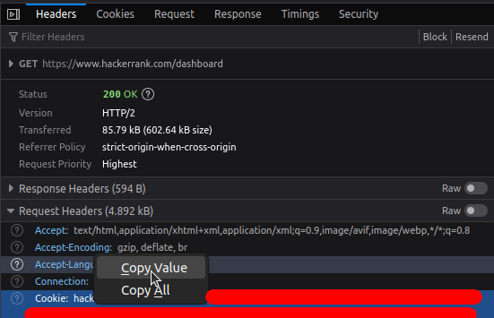
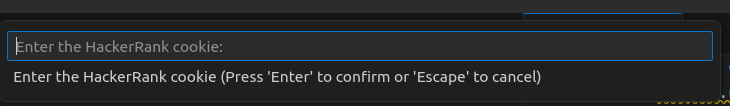
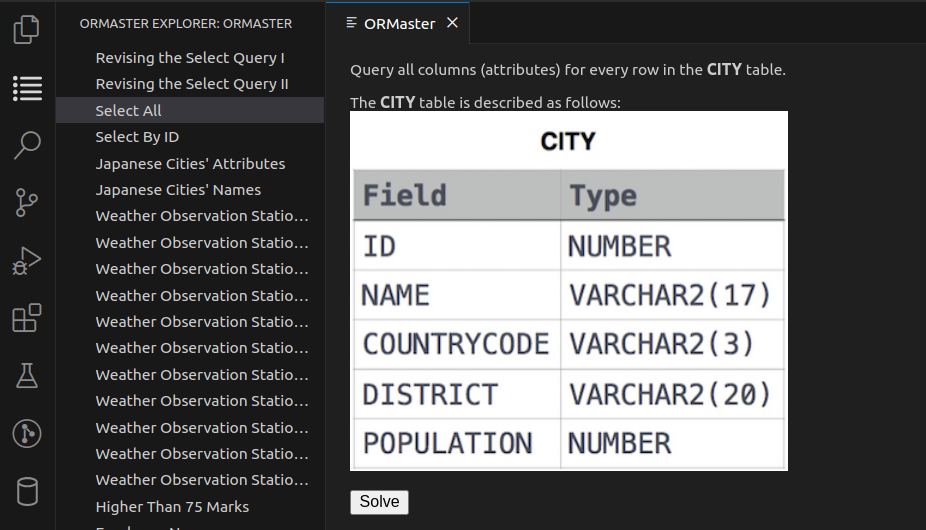
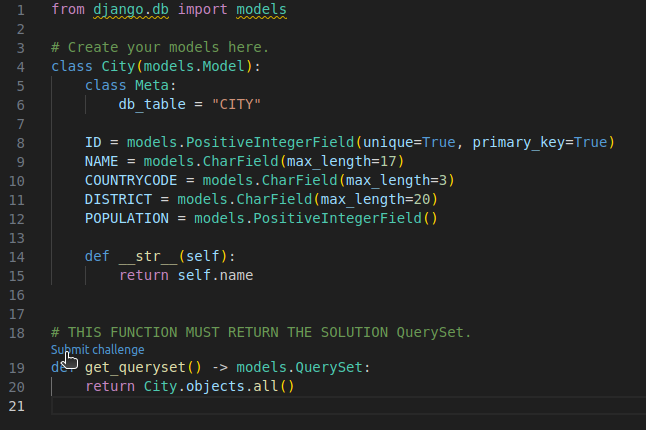
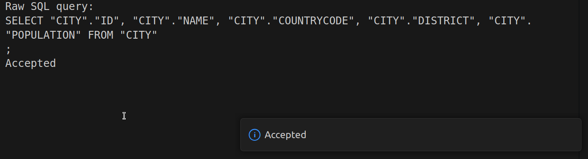

# ORMaster - Solving SQL challenges w/ web frameworks ORM

  

## Overview

ORMaster is a Visual Studio Code extension designed to enhance the process of learning web frameworks (e.g., Django) Object-Relational Mapping (ORM), through solving SQL challenges. The extension pulls challenges from different providers (e.g., HackerRank), and, instead of using raw SQL queries, ORM queries can be used.

## Usage

1. Login to your preferred provider (currently, HackerRank).
    1. (Optional) Create a new HackerRank account
    2. Get the cookie value from your browser 

        

    3. Use the command palette (Ctrl+Shift+P) and search for "ORMaster: Login to HackerRank"

        

2. Choose any challenge from the list of challenges and press on the "Solve" button. 
    

3. Write the solution to the given problem in `get_queryset` function. Press on the "Submit challenge" link that's above the `get_queryset` function to submit your solution to the provider for evaluation.

    
    

## Supported Providers

- HackerRank

## Supported Web Frameworks

- Django

## TODO

- Add support for more web frameworks (e.g., Laravel).
- Add support for more providers (e.g., LeetCode).
